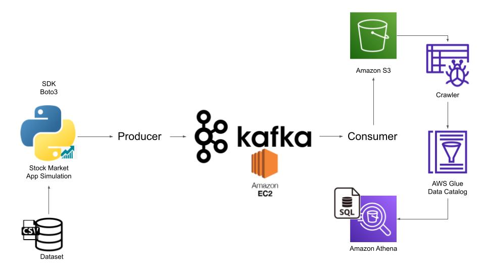

# realtime-DataIngestion
This repository uses AWS cloud services and Big Data technologies to process data in real time and archive data in data lake storage 

# Architecture of the project

# AWS setup

We created a free-tier account on AWS. Then performed the following activities:

1. Launched a new EC2 instance
2. While creating a new instance, we generated a new key-pair value so that we can extract a .pem file and connect to the machine through local.
3. Once the instance is up and running and the .pen file is saved on your local machine, open your terminal and navigate to the folder where your .pem file is.
4. Copy the ssh command from your AWS account and run it on your terminal (assuming you are on the same .pem file location).
5. For Mac user, there might be a permission denied error. So before executing the ssh command, execute the following command:

        chmod 400 <name of the .pem file>

# Kafka Setup on your EC2 machine

Once the EC2 machine is up and running, we need to install Kafka on that machine. So, we will be performing the following activities:

1. Get the compressed version of Kafka on your EC2 instance

    wget https://downloads.apache.org/kafka/3.3.1/kafka_2.12-3.3.1.tgz

2. Un-compress the Kafka files:

    tar -xvf kafka_2.12-3.3.1.tgz

In order to run Kafka, we need to install Java on your remote machine. In order to do that perform the following commands:

1. sudo yum install java-1.8.0-openjdk
2. java -version

Once Java is installed, we need to navigate to the kafka folder and then start the zookeeper service.

1. cd kafka_2.12-3.3.1

# Run Zookeeper service

    bin/zookeeper-server-start.sh config/zookeeper.properties

1. bin/zookeeper-server-start.sh --> command to start the zookeeper service
2. config/zookeeper.properties --> config file that runs the service and holds secret keys.

# Run Kafka server

Open a new terminal and run the Kafka server. But first ssh to to your ec2 machine as done above. Since we are running our Kafka server on a single EC2 
instance, we will set the memory of the server and for that execute the following command:

    export KAFKA_HEAP_OPTS="-Xmx256M -Xms128M"

    bin/kafka-server-start.sh config/server.properties
1. bin/kafka-server-start.sh: Run the kafka server
2. config/server.properties: Config files

But there is an issue with this approach. Although both our zookeeper and kafka server are running but we won't be able to connect to our Kafka server to 
send data for real-time processing. This is because the DNS on which the kafka is running, it's on private server. And we will be working on local machine. Hence we need to change the ip address to a public ip address. To do this, perform the following actions:

1. Stop the zookeeper and kafka server
2. Run the following command:
    sudo nano config/server.properties

This will open the properties file.

3. change ADVERTISED_LISTENERS to public ip of the EC2 instance

Re-run the zookeper and kafka server.

Now, we will also need to edit security inbound rules. Hence navigate to the Security section of the instance. Click on the security Groups and click on edit inbound rules. After that add another rule, "Allow all traffic" through "Anywhere with IPv4".

Usually this will be handled by the DevOps engineer.

# Create the topic:

cd kafka_2.12-3.3.1
bin/kafka-topics.sh --create --topic demo_testing2 --bootstrap-server {Put the Public IP of your EC2 Instance:9092} --replication-factor 1 --partitions 1

# Start the Producer

bin/kafka-console-producer.sh --topic demo_testing2 --bootstrap-server {Put the Public IP of your EC2 Instance:9092} 

# Start the Consumer

Duplicate the session & enter in a new console --
cd kafka_2.12-3.3.1
bin/kafka-console-consumer.sh --topic demo_testing2 --bootstrap-server {Put the Public IP of your EC2 Instance:9092}

# Create S3 bucker

1. pip3 install s3fd
2. Login into your AWS console
3. Search for S3 resource
4. Give your bucket a name
5. Click on create bucket

# Configure Local machine to AWS console

In order to send data from local machine to AWS console (like S3 instance) we need to configure AWS access key and secret key. For that, we need to add a user through the IAM portal in our AWS console.

1. Login into AWS console
2. Navigate to IAM
3. Inside Access Management, click on Users and then click on Add Users
4. Give your user a name
5. Then click the "Provide user access to the AWS Management Console - optional" option
6. Then select "I want to create an IAM user" to give access to the user programatically
7. After clicking next, we need to give permissions to the user. Select "Attach policies directly" and then click on "Administrative Access".
8. You can then download a csv file that contains your credentials.
9. Go to your terminal, and write aws configure. Provide your access and secret key ID.

